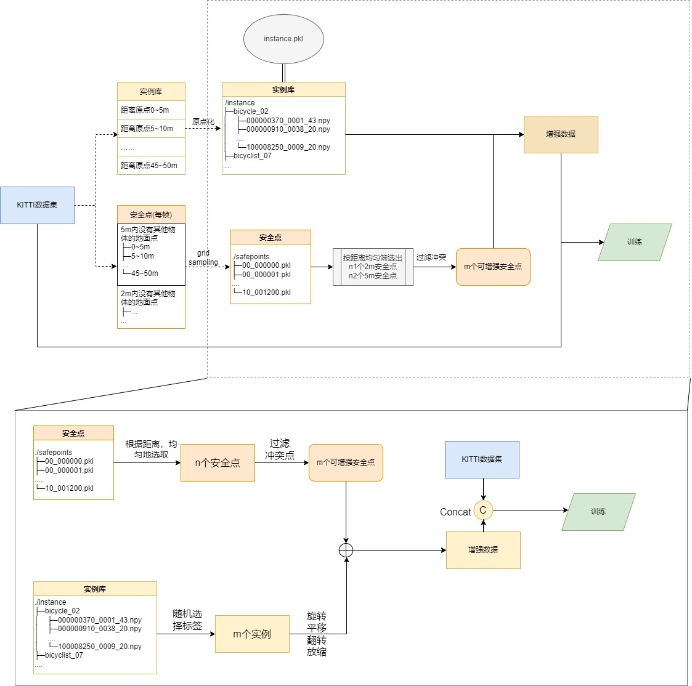

# Cutmix for SemanticKITTI

## Prepare data for point cloud cutmix

If you are running the project first time, you need to change the configuration in **"config.yaml"** and run the **"prepare.py"** to generate the instance_lib and safe points. Then, you can use semantic-kitti cutmix augment in your kitti dataset by import **"cutmix.py"**. Currently, we only have done the work about generating semantic labels. That's mean you can only use cutmix in semantic segmentation or unsupervised task.

**The generation process requires a GPU, and GPU 0 is used by default. You can change it at line 12 of safepoints.py**

## When you use cutmix.py

1. Change the `work_path` in cutmix.py
2. You can modify the classes' weights at line 16 of config.yaml
3. You can modify the augment instance number at line 11 of config.yaml
4. Please initializing object with class CutmixAugment in dataset's `__init__` and calling `CutmixAugment.cutmix()` in dataset's `__getitem__`. The process spends about 0.1s in default config.

